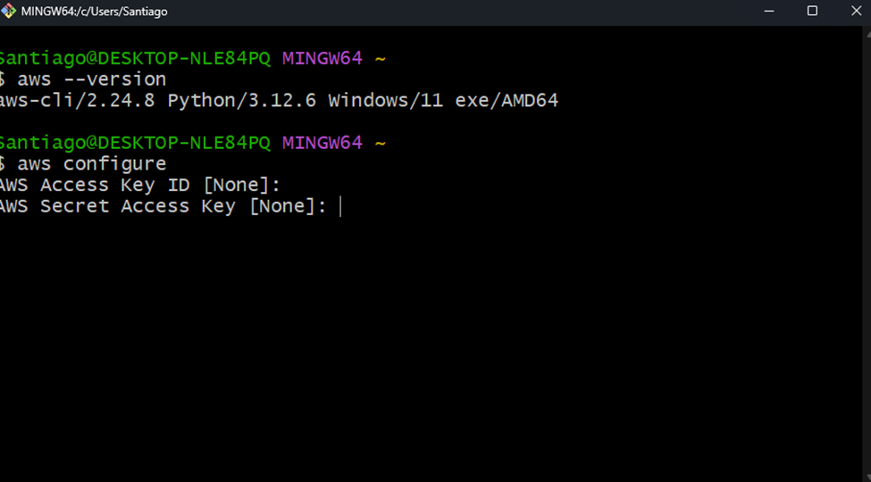
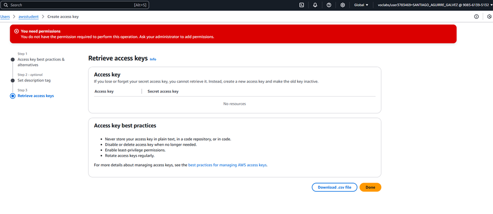
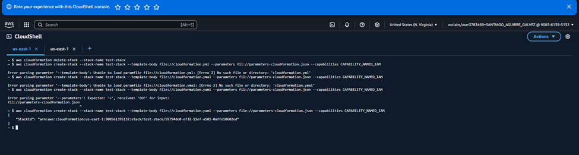
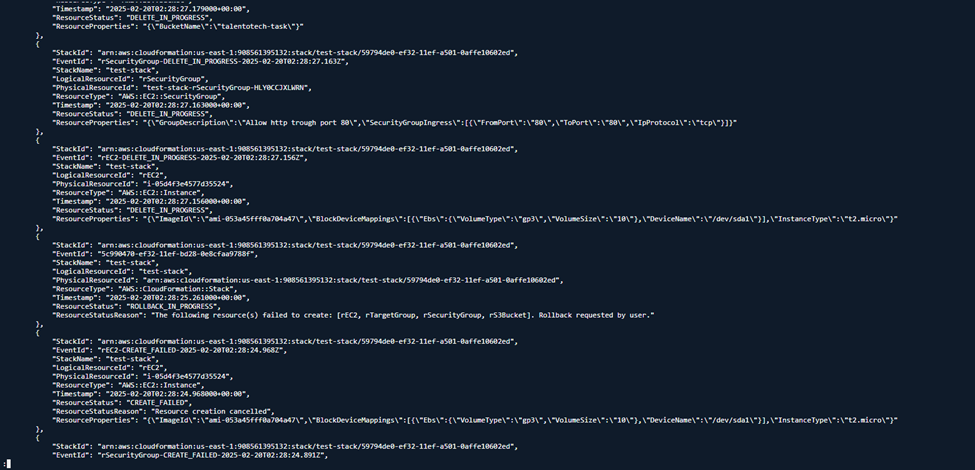
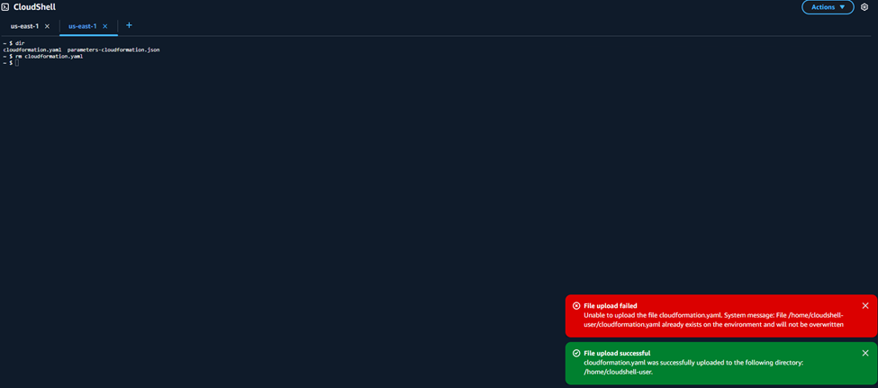
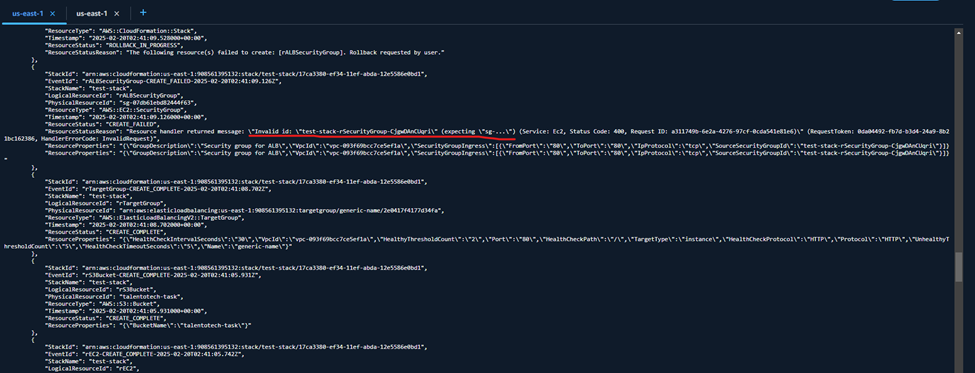
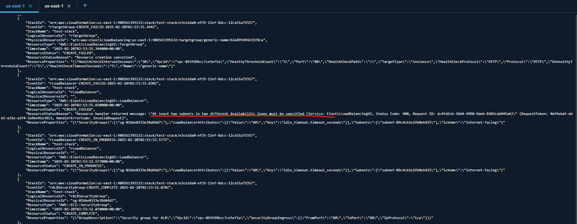

# cloudformation
Se intenta hacer login por consola local con los keys de amazon pero no se puede hacer login por consola local

Se ingresa por la consola de aws directamente

Se encuentran errores de nombres de recursos entre otros

Se remueven archivos y se cargan nuevamente

Se prueba de nuevo y se encuentran nuevos errores:

Finalmente se eliminan los errores y se cargan nuevamente
